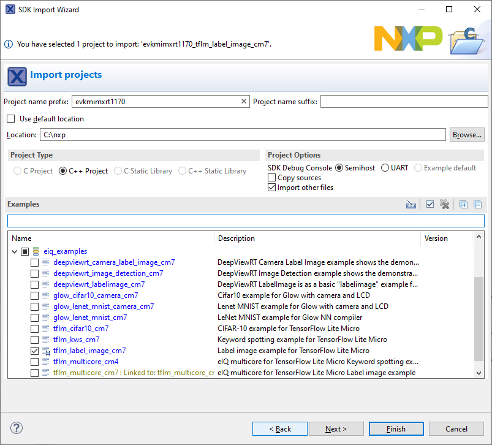

# Example applications

The eIQ TensorFlow Lite library is provided with a set of example applications. For details, see [Table 1](example_applications.md#TABLE_LISTOFEXAMPLEAPP). The applications demonstrate the usage of the library in several use cases.

|Name|Description|Availability|
|----|-----------|------------|
|`tflm_cifar10`|CIFAR-10 classification of 32 × 32 RGB pixel images into 10 categories using a small Convolutional Neural Network \(CNN\).|MCX-N947-EVK \(no camera and display support\)   MCX-N947-FRDM \(no camera and display support\)   MCX-N547-EVK \(no camera and display support\)   MIMXRT700-EVK \(no camera and display support\) |
|`tflm_kws`|Keyword spotting application using a neural network for word detection in pre-processed audio input.|MCX-N947-EVK \(no audio support\)   MCX-N947-FRDM \(no audio support\)   MCX-N547-EVK \(no audio support\)   MIMXRT700-EVK \( no audio support\) |
|`tflm_label_image`|Image recognition application using a MobileNet model architecture to classify 128 × 128 RGB pixel images into 1000 categorieswith eIQ Neutron NPU.|MCX-N947-EVK \(no camera and display support\)   MCX-N947-FRDM \(no camera and display support\)   MCX-N547-EVK \(no camera and display support\)   MIMXRT700-EVK \(no camera and display support\)|
|`tflm_label_image_ext_mem`|Image recognition application using a MobileNet model architecture to classify 224 × 224 RGB pixel images into 1000 categorieswith eIQ Neutron NPU.   In this example, it demonstrates how to fetch model's weight from external memory(xSPI flash) to internal SRAM for Neutron NPU execution.|MIMXRT700-EVK \(no camera and display support\)|
|`tflm_cifar10_hifi4`|CIFAR-10 classification of 32 × 32 RGBpixel images into 10 categories using a small Convolutional Neural Network.  In this example, M33 core0 starts HiFi4 DSP core with HiFi4 DSP image. HiFi4 DSP does the inference for CIFAR-10 classification.| MIMXRT700-EVK \(no camera and display support\)|
|`tflm_label_image_hifi4`|Image recognition application using a MobileNet model architecture to classify 128 × 128 RGB pixel images into 1000 categories.   In this example, M33 core0 starts HiFi4 DSP core with HiFi4 DSP image. HiFi4 DSP does the inference for image recognition application.| MIMXRT700-EVK \(no camera and display support\)|

For details on how to build and run the example applications with supported toolchains, see *Getting Started with MCUXpresso SDK User’s Guide* \(document: MCUXSDKGSUG\). When using MCUXpresso IDE, the example applications can be imported through the SDK Import Wizard as shown in [Figure 1](example_applications.md#FIG_IDEIMPORTWIZARD).

| 

|

After building the example application and downloading it to the target, the execution stops in the *main* function. When the execution resumes, an output message displays on the connected terminal. For example, [Figure 2](example_applications.md#FIG_IDECONSOLEWINDOW) shows the output of the `tflm_label_image_cm7``tflm_label_image` example application printed to the MCUXpresso IDE Console window when semihosting debug console is selected in the SDK Import Wizard.

| 

|

