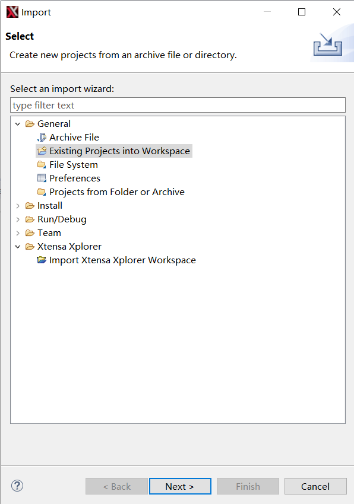
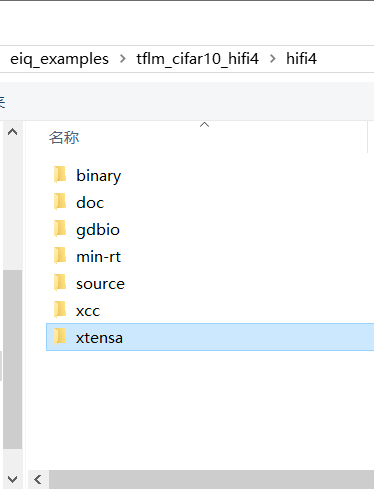
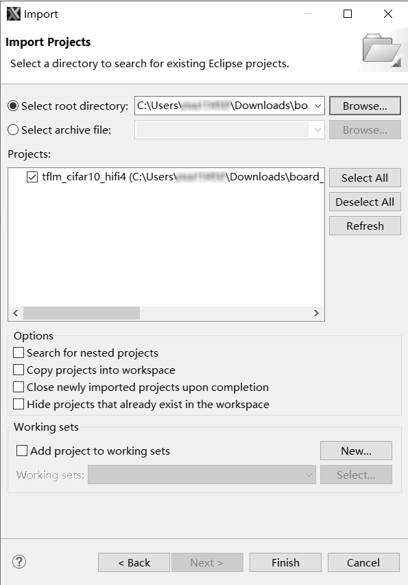
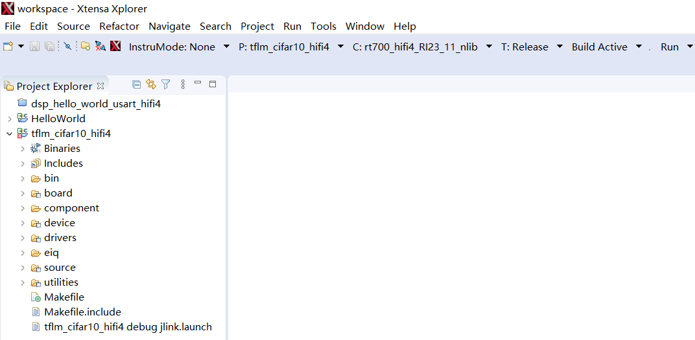
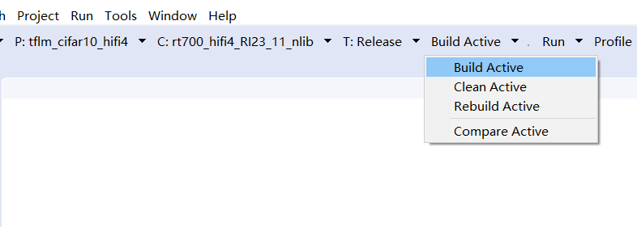

# Prepare DSP core for the examples

The projects for different supported toolchains are built. The “xcc” project builds on the command line and the “xtensa” directory is an Xplorer IDE project.

To run the `tflm_cifar10_hifi4` example, import the SDK sources into the Xplorer IDE.

1.  Select **File \> Import \> General \> Existing Projects into Workspace**.

    

2.  Click **Next**.
3.  Select the `SDK directory/boards/mimxrt700evk/eiq_examples/tflm_cifar10_hifi4/hifi4/xtensa` as the root directory.

    

4.  Click **Select Folder**.
5.  Leave all the other options check boxes blank.

    

    Once imported, the `tflm_cifar10_hifi4` example appears in the **Project Explorer**.

6.  To make a build selection for the project and hardware target configuration, use the drop-down buttons on the menu bar.

    

7.  To build the DSP application image for the CM33 application, select the **Release target** option in the Xplorer IDE as below.

    

8.  Three DSP binaries are generated and are loaded into different TCM or SRAM address segments:
    -   `<SDK_ROOT/>/boards/mimxrt700evk/eiq_examples/tflm_cifar10_hifi4/hifi4/binary/dsp_data_release.bin`
    -   `<SDK_ROOT/>/boards/mimxrt700evk/eiq_examples/tflm_cifar10_hifi4/hifi4/binary/dsp_literal_release.bin`
    -   `<SDK_ROOT/>/boards/mimxrt700evk/eiq_examples/tflm_cifar10_hifi4/hifi4/binary/dsp_text_release.bin`

**Parent topic:**[Run and debug eIQ HiFi4 and HiFi1 DSP examples using Xplorer IDE](../topics/run_and_debug_eiq_hifi4_and_hifi1_dsp_examples_usi.md)

